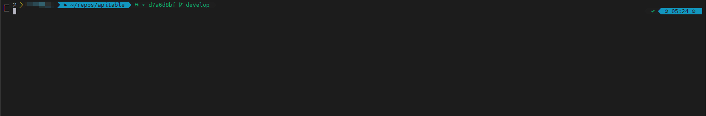

# setup-scripts

[English](./README.md) | 简体中文

## 简介 
个人 Posix 环境配置脚本。

### 功能

- Shell：基于 **[oh-my-zsh](https://ohmyz.sh/)** 安装脚本和 [shell-set-up](https://github.com/Thrimbda/shell-set-up)。
- 系统：git/apt mirror/一些其他工具
  - 目前支持以下操作系统 
    - Ubuntu
    - Debian
- Git：通过提示配置 git user.name & user.email 和 ssh key。
- Node：nvm & node & nrm & yarn & cnpm & pnpm。
- Python：pyenv & python & pip & poetry & pipenv。
- Golang：gvm & go（并自动配置代理和镜像）。
- Rust：开发中
- Java：开发中
- Docker：docker & docker-compose。
- Tmux：tmux 和配置，基于 [aak1247/.tmux](https://github.com/aak1247/.tmux)。
- ProxyChains：开发中
- ......

如果您不需要这些组件，可以自由选择。

### 用法:

```bash
# 通过 curl
sh -c "$(curl -fsSL https://github.com/aak1247/setup_scripts/raw/master/install.sh)"

# 通过 wget
sh -c "$(wget https://github.com/aak1247/setup_scripts/raw/master/install.sh -O -)"

```
最终，你将得到一个漂亮的 zsh！不用担心，你的旧的 .zshrc 会备份为 .zshrc.back（如果有的话）。
如果您想采用我的配置，请将 .zshrc 中的 DEFAULT_USER 变量替换为您的用户名，并取消注释（默认是 $USER@$HOSTNAME）。
最后，记得安装 powerline+awesome(nerd) 字体 （我正在使用的是 meslo），以显示所有这些美妙的东西！

## 屏幕截图
### Zsh



## 相关

- [Thrimbda/shell-set-up](https://github.com/Thrimbda/shell-set-up)
- [.tmux](https://github.com/aak1247/.tmux)